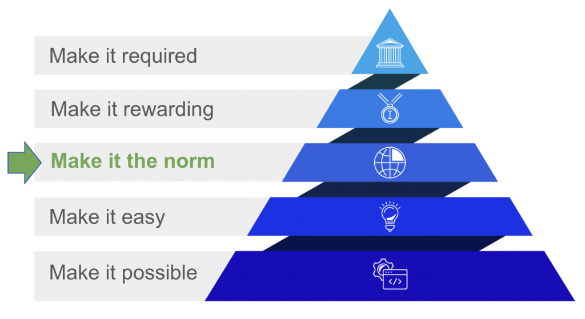

> Recovered historical content from the Internet Archive. Links and advice reflect the archived site.

Welcome to the hub for researchers interested in exploring the evolving applications of Large Language Models (LLMs) and Generative AI (genAI) as tools in their scientific investigations. Whether you’re brainstorming research designs, delving into sentiment analysis, coding data, combining datasets, or tackling other research tasks, LLMs offer unparalleled capabilities that can revolutionize your research workflow.

Our website offers resources, carefully curated to provide a comprehensive guide for researchers interested in incorporating LLMs into their work. We are collecting a wealth of examples of research articles that have utilized LLMs in their methods, showcasing the wide-ranging applications across diverse fields of study. From social sciences to natural sciences, from humanities to health sciences, LLMs and genAI are making waves in research domains all over the world.

**Making** **Transparent & Reproducible the Norm**  
One of our goals is to promote the transparent and reproducible use of LLMs in research by sharing the evolving [norms](https://philpapers.org/archive/DIEWIA-5.pdf) on how LLMs (and genAI) can be ethically employed and documented in science workflows.

**For Researchers**   
If you are eager to explore the potential of LLMs in your research, our website offers a growing body of resources to support you on your journey. Whether you’re a seasoned expert or new to your field, our site provides tutorials, guides, and best practices for getting started with LLMs and genAI in scientific research. The site offers valuable insights on common pitfalls to avoid and tips for optimizing LLM-based research methodologies.

**For Peer Reviewers**  
One of the unique features of our website is that we offer guidelines for reviewing submitted journal articles that utilize LLMs and/or genAi in their methods. By supporting peer review, we aim to contribute to the advancement of LLM-driven research and facilitate the creation of positive norms in the transparent use of LLMs and genAI.

*Note: Graphic based on [Ce](https://www.cos.io/about)[nter for Open Science](https://www.cos.io/about)*
